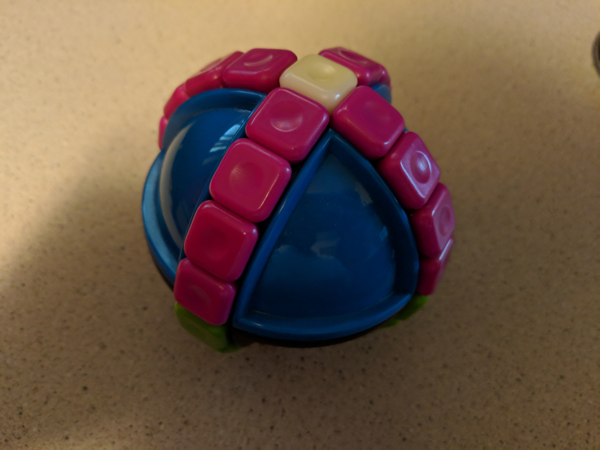

# SphereXYZ

This is a solver for a weird puzzle a friend gave me called the SphereXYZ. It is a spherical puzzle with two rings of plastic squares that slide in either direction. In addition, the two hemispheres are separate, and you can turn the top hemisphere in 90-degree increments. There are 16 purple pieces, 16 green pieces, and 2 white pieces. In the solved state, the white pieces are at the poles and all the purple pieces are on the same hemisphere; however, this solver instead solves for the state where one ring is green, and one ring is purple. It is two moves (M9 U) to go from this state to the official solved state.

# How it works

The solver uses IDA*, a variant of A* that progressively increases the search depth in order to be more memory efficient than BFS. First, the solver builds a heuristic table by searching states starting from the solved state. Then, the solver uses this table to guide its search for the optimal solution.
